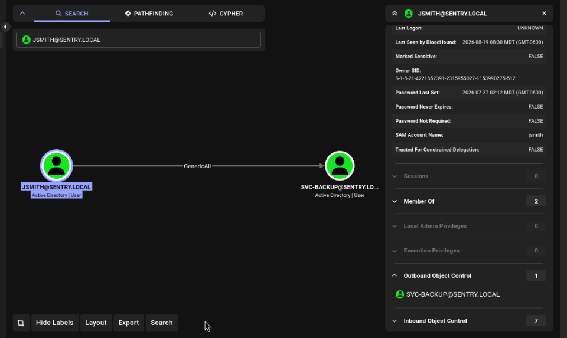
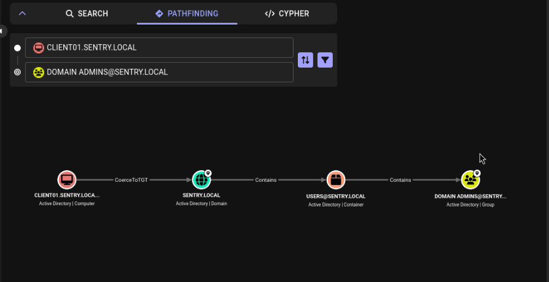
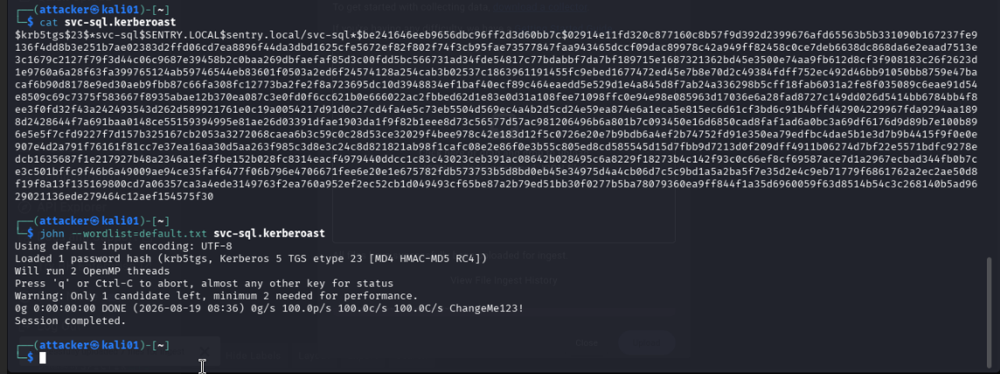
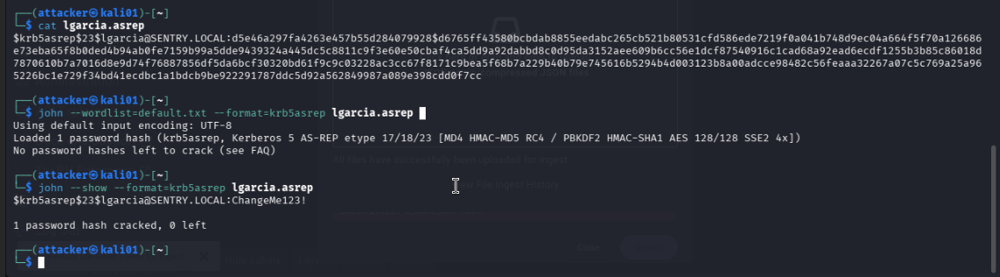
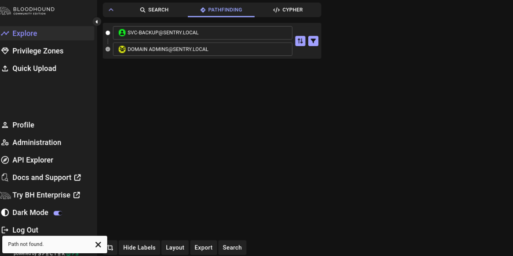

# 03 - Enumeration
This is the blind phase of the attacker. Enumerate the domain blind, find out what an authenticated but unprivileged user could see, and confirm the planted weaknesses are actually exploitable. [02-misconfigurations.md](02-misconfigurations.md) was written first and kept off the lab, so everything below was discovered from the position of an attacker. 

## Attacker Position
All enumeration and vulnerabilities ran from `kali01` (`10.10.10.30`), authenticated only as jsmith, a standard IT-OU domain user with no elevated privileges. This mirrors a realistic starting point, a phished or otherwise compromised low-privilege account, not a stolen admin credential. 

## Tooling
- `bloodhound-python`: graph-based AD relationship collection 
- BloodHound CE + Neo4j: graph analysis and visualization 
- `impacket` (`GetUserSPNs.py`, `GetNPUsers.py`): Kerberoasting and AS-REP roasting 
- John the Ripper: offline hash cracking 

## BloodHound Collection 
Ran a full collection as jsmith: 
```
bloodhound-python -u jsmith -p 'ChangeMe123!' -d sentry.local -ns 10.10.10.10 -c all
```

This alone, the same read access every employee's account already has by default, was enough to map out both attack paths below.

### Finding 1: GenericAll - `jsmith` -> `svc-backup`
BloodHound surfaced a direct `GenericAll` edge from `jsmith` onto the `svc-backup` service account object. Anyone who compromises `jsmith` inherits full control over `svc-backup`. An attacker can reset its password outright or even quietly write a SPN onto it to Kerberoast and crack the hash offline so the real owner never notices a change. 


### Finding 2: Unconstrained Delegation - `CLIENT01` -> Domain Admins
The more serious finding: `CLIENT01` -> `CoerceToTGT` -> `SENTRY.LOCAL` -> `Domain Admins`. Because `CLIENT01` is trusted for unconstrained delegation, and a privileged account had previously RDP'd into it, that account's TGT was left sitting in `CLIENT01`'s memory, making it retrievable by anyone with admin rights on the box. Combined with a coercion technique, like a printer-bug, an attacker can force the domain controller itself to authenticate to `CLIENT01`, capture its TGT, and walk directly to Domain Admin.


### Finding 3: Weak Default Password - Kerberoasting & AS-REP Roasting
`svc-sql` had an SPN on the network, which allowed for Kerberoasting. An attacker with any authenticated domain user account could easily request a ticket, grab the hash, and crack it offline. The user `lgarcia` had Kerberos pre-authentication disabled (`UF_DONT_REQUIRE_PREAUTH`), making the account vulnerable to AS-REP roasting. An attacker wouldn't even need valid credentials to request the AS-REP and pull a crackable hash for the account. 


Both hashes were requested with `impacket-GetUserSPNs` and `impacket-GetNPUsers` and cracked offline with John the Ripper instantly, confirming both accounts were using weak, easily guessable passwords. 



### Finding 4: `svc-backup` escalation contained 
Using BloodHound's Pathfinding tool, I searched directly for a path between `svc-backup` and the Domain Admins group. No path was found between them.

Unlike in Finding 2, compromising `svc-backup` (via the `GenericAll` edge from `jsmith`) doesn't lead anywhere further. It is a dead end for privilege escalation. The only edge BloodHound surfaces between these two nodes runs the opposite direction, from the Domain Admins to `svc-backup`. 
