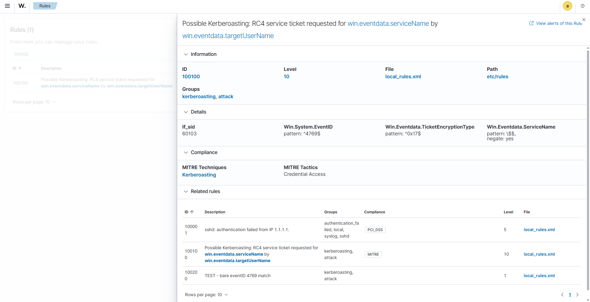
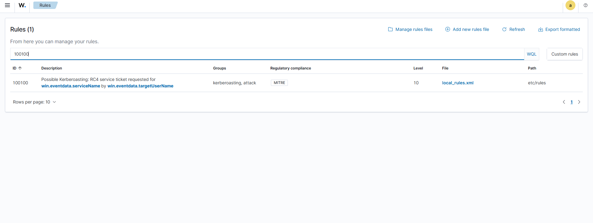
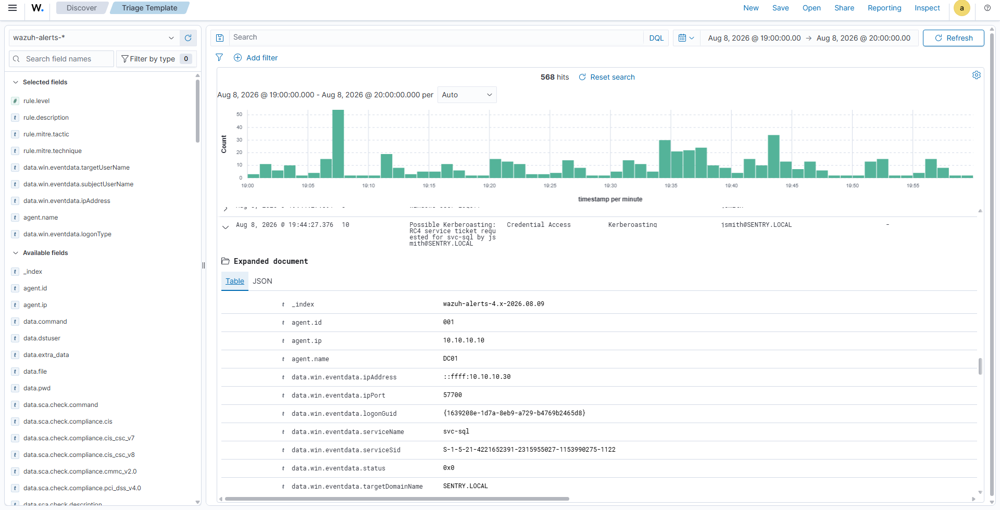
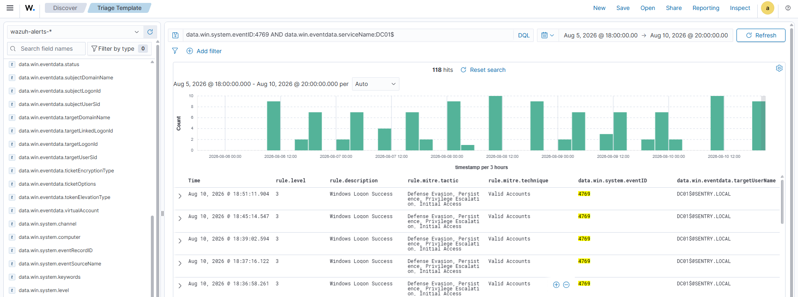

# 04 - Detection & Logging

## Goal
In this phase, I was looking to see if the misconfigurations confirmed in enumeration would leave any traces to detect as they happened. 

## Windows Audit Policy
Enabled the following `Advanced Audit Policy subcategories` on `DC01` via `auditpol`. Each was set to `Success and Failure`
| Subcategory | Event IDs it produces |
| --- | --- |
| Kerberos Service Ticket Operations | 4769 | 
| Kerberos Authentication Service | 4768 | 
| Logon | 4624 (success) / 4625 (failure) 
| Process Creation | 4688 | 
| User Account Management | account create/modify/delete events|
| Security Group Management | group membership change events | 

- 4769 and 4768 are the two that I wanted to focus on, since they're what makes the Kerberoasting and the AS-REP roasting actually detectable in the first place. 

## Wazuh SIEM Setup
Created another virtual machine, `wazuh01`, to run Wazuh 4.13.1 and act as a single all-in-one instance: manager, indexer, and dashboard, rather than splitting it across 3 separate machines. It runs Ubuntu 26.04 with a dual-NIC so it can connect to the actual internet and so it has a spot on my lab network at `10.10.10.40`. Agents were then installed on `DC01` and `CLIENT01`, both confirmed forwarding via the Discover tab and seeing 4624 and 4634 logon events tagged with the corresponding agent name and decoder. 

Before trying to detect the misconfigurations, I wanted to test a known,  built-in rule within Wazuh, a brute-force detection rule that fires after 8 failed logons within a 240-second window. I deliberately triggered it to confirm the entire pipeline worked end to end. (audit poliy -> agent -> manager -> rule -> alert) 

## The Detection Gap
A raw 4769 isn't a useful signal on its own, in a real domain, this event fires constantly for completely ordinary reasons: file shares, SQL connections, print jobs, anything with a registered SPN. Alerting on the event ID alone wouldn't be a Kerberoasting detector, it would be noise that trains analysts to ignore the tool crying wolf. So instead, the rule looks downstream at a field inside the event, Ticket Encryption Type. Modern Windows clients request AES by default, tools like `impacket` deliberately request the weaker RC4 cipher instead, since it's faster to crack offline once captured. That specific downgrade is the signature to focus on, not just that the ticket was requested. 

## Building the Kerberoasting Detection Rule
Translating the signature to an actual Wazuh rule meant checking three fields together: the event ID itself (4769), the ticket encryption type (RC4 vs AES), and excluding service names ending in $ since Windows appends it to computer account names and not user accounts. 

The rule was set to level 10, well above the generic level-3 noise most Windows activity falls into, and tagged with MITRE ATT&CK technique T1558.003, the official identifier for Kerberoasting. I also used an official Wazuh blog post containing a working Kerberoasting rule as reference. Their example had used a hard-matched `TicketOptions` field value that didn't really match my captured traffic, so I dropped that condition. 

## Debugging the Pipeline
Before the Kerberoasting rule could be tested against real traffic, 3 separate machines--`DC01`, `CLIENT01`, and `kali01`--all turned out to have clocks that were not aligned with each other, which makes timestamp-based troubleshooting effectively useless until it was resolved. To fix this time issue, I checked `DC01` first. `DC01` being the only domain controller, automatically holds the PDC Emulator role, which makes it the authoritative time source the rest of the domain syncs from. Because of that role, Windows stops manual time changes through the normal settings GUI. To get around it, I opened an elevated Powershell, stopped the Windows Time Service, set the correct time directly with `Set-Date`, restarted the service, and had to mark the clock as reliable with `w32tm /config /reliable:yes /update` so Windows Time Service would trust it going forward. With `DC01`'s clock corrected, `CLIENT01` and `kali01` just needed to resync against it. 

Correcting the clocks on `DC01` and `CLIENT01` had an unexpected side effect, both machines' Wazuh agents flipped to a pending state in the dashboard. The manager tracks how long it's been since each agent last checked in by comparing timestamps, so an abrupt clock jump threw the math off enough for the manager to lose track of who was actually still connected. The fix was the simple, just restarting the `WazuhSvc` service on both machines forced a fresh check-in with the correctly-timed heartbeat, and both flipped back to active shortly after. 

Once the clocks were fixed, I ran the Kerberoast and did not see the alert in the Wazuh dashboard. I checked the rule file itself and it checked out clean on every front -- correct syntax, correct file permissions, registered in the right directory, no ID conflicts with the default ruleset, and a clean service restart with no errors logged. Even the `wazuh-logtest` confirmed the rule matched correctly against the exact real event. And yet, nothing showed up as an alert. 

The real cause turned out to have nothing to do with the rule's own conditions. Wazuh doesn't check every rule independently against every log. Windows EventChannel events are first caught by a built-in root rule, and only that rule's children (linked via `if_sid`) get evaluated afterward. An independent, standalone rule outside that tree is never considered at all. First, I tried to connect the rule via `if_sid` to `60106`, the Windows Logon Success rule, since I had seen that rule catching 4769 events before the custom rule even existed. This didn't work because `60106` was itself a child rule, not the root. With this configuration, Wazuh would only check my rule after `60106` had already matched and finished. Once I connected the rule to `60103` instead, `60106`'s own parent, and the actual root-level rule Windows Security events get caught by first, it then became a sibling of `60106` rather than a child. This allowed it to finally be evaluated. 

## Verification
With the rule correctly attached to the rule tree, two pieces of evidence confirmed that it actually worked. 

**Before/after, same real event.** Before the `if_sid` fix, real Kerberoasting attempts against `svc-sql` weren't matching this rule at all, since it sat outside the tree Wazuh actually evaluates. After the fix, running the exact same attack produced a properly named, level 10 alert: 
Possible Kerberoasting RC4 service ticket requested for `svc-sql` by `jsmith@SENTRY.LOCAL`, correctly tagged with MITRE technique T1558.003. Same attack, same target account, same underlying event, only thing that changed was whether the rule was actually being evaluated. 

**A true negative.** Just as important as catching the attack was *not* catching normal traffic. Legitimate machine-account Kerberos requests (`DC01$` and `CLIENT01$` authenticating to each other using AES) continued to be classified under Windows' standard logon-success rule rather than the Kerberoasting rule. The rule correctly ignored them. This matters because a detection that also fires on routine domain traffic isn't really a detection at all. 

## Takeaways
The core lesson ties directly back to [The Detection Gap](#the-detection-gap): a rule is only as good as what it deliberately excludes, not just what it catches. Alerting on the raw event would have been trivial and useless. The work was in building something that told the difference between an attacker and routine traffic. 

The bigger lesson was in the debugging itself. Every individual piece--the clock sync issue, the agent state, the rule file's syntax and permissions--all checked out clean, while the alert still didn't fire. The actual cause turned out to be something none of those checks could have surfaced, understanding how Wazuh's rule engine decides what to evaluate at all. That's the kind of problem that doesn't get solved by trying things faster, it gets solved by actually understanding the system well enough to ask a better question.