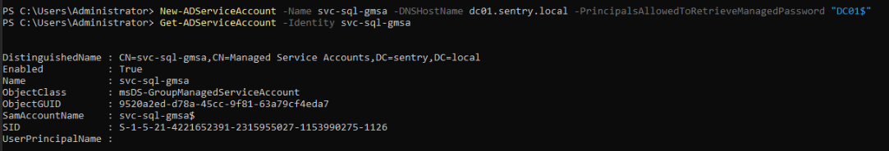
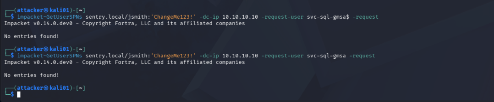
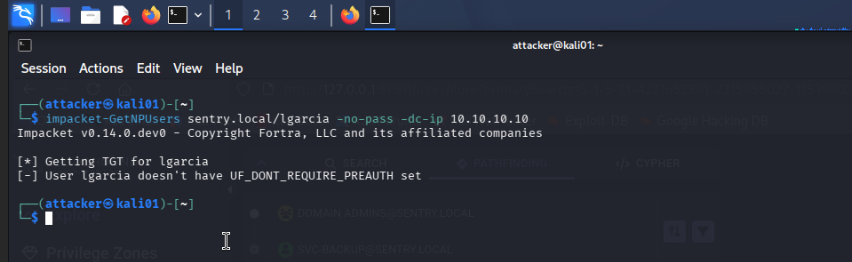
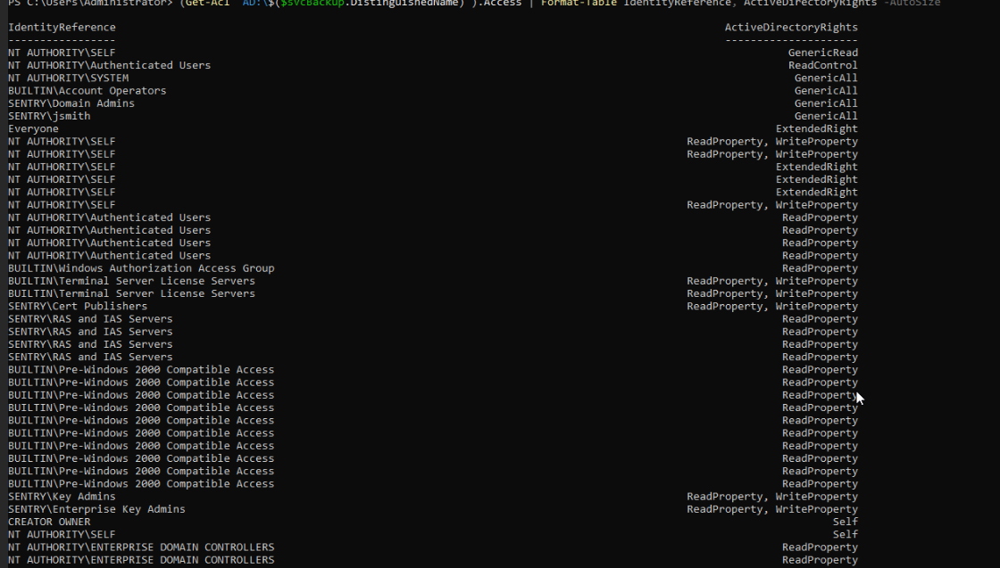
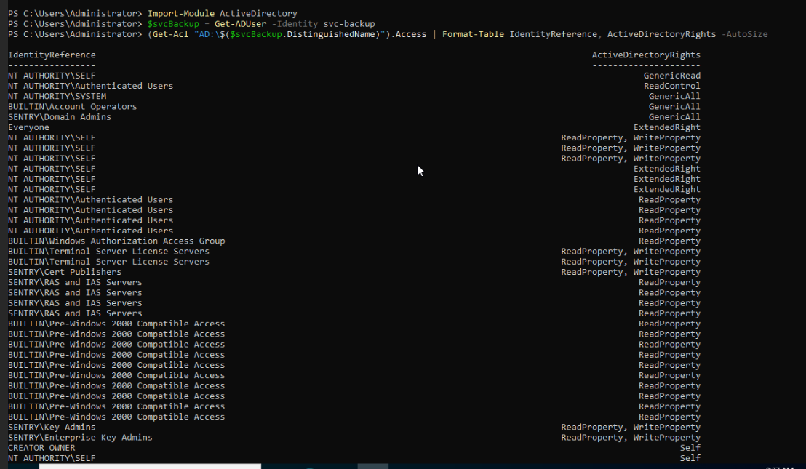
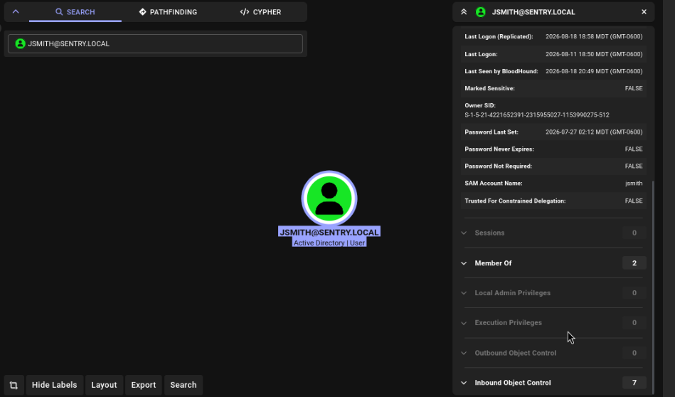
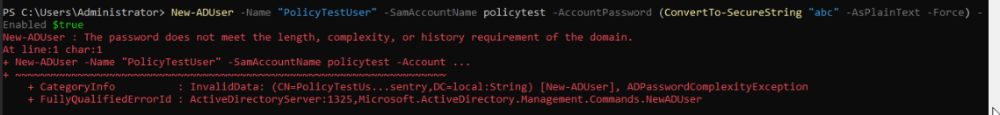
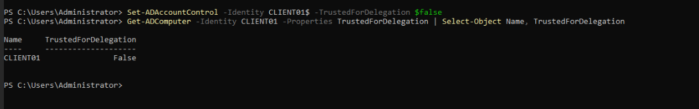
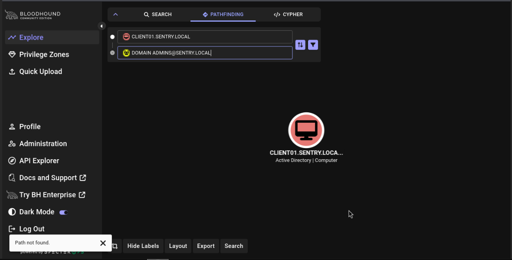

# 05 - Remediation

## Goal
This phase closes the loop opened in [02-misconfigurations](02-misconfigurations.md) and [03-enumeration](03-enumeration.md). Each misconfiguration planted and successfully attacked earlier gets fixed here, then re-attacked the exact same way to confirm the fix actually holds. Not just that a setting changed, but also that the attack path is genuinely closed. 

## Finding 1: `svc-sql` -> gMSA Conversion
In order to make `svc-sql` more secure, especially to Kerberoasting, I had a couple options: creating a new longer and complex password, or using gMSA and KDS root keys. I went with the latter since the gMSA creates new random keys every 30 days by default. With a randomly-generated key this long, cracking the hash offline is effectively impossible. Rerunning the Kerberoast using the same `impacket-GetUserSPNs` command on `kali01` this time gave me no results due to gMSAs being a different Active Directory object class (computer-category, not user). Standard Kerberoasting tools like `GetUserSPNs` exclude them from their search entirely. 

## Finding 2: Re-enabling Pre-Authentication on lgarcia
On the Domain Controller, `DC01`, on an elevated PowerShell session, `Set-ADAccountControl -Identity lgarcia -DoesNotRequirePreAuth $false`, was run to remove the flag that let `lgarcia` skip Kerberos pre-authentication, which is what made the AS-REP attack possible in the first place. With pre-authentication required again, there is no way for an attacker to run an AS-REP attack. Using the `Get-ADUser` command, I was able to see that lgarcia's `DoesNotRequirePreAuth` flag was set back to false and also back on `kali01`, the `impacket-GetNPUsers` command showed an error, `User lgarcia doesn't have UF_DONT_REQUIRE_PREAUTH set` on runtime.

## Finding 3: Removing jsmith's GenericAll over svc-backup
Using `Get-ADUser`, `Get-Acl`, and `Set-Acl` commands, I was able to remove `GenericAll` from `jsmith`s access rules. Again, using a `Get-Acl` command, I was able to confirm that the account `jsmith` had `GenericAll` access taken away and then took it a step further on the `kali01` machine. On that machine, I reran BloodHound collection and re-uploaded into BloodHound's UI and saw no edge between `jsmith` and the `svc-backup` account. 

## Finding 4: Hardening the Default Domain Password Policy
On `DC01`, on an elevated PowerShell session, I ran `Set-ADDefaultDomainPasswordPolicy -Identity sentry.local -MinPasswordLength 12 -ComplexityEnabled $true -LockoutThreshold 5 -LockoutDuration 00:15:00 -LockoutObservationWindow 00:15:00`. I ran `Get-ADDefaultDomainPasswordPolicy -Identity sentry.local` to confirm that the changes took place. I also ran `New-ADUser -Name "Policytestuser" -SamAccountName policytest -AccountPassword (ConvertTo-SecureString "abc" -AsPlainText -Force) -Enabled $true` to make sure I would get the error, `"The password does not meet the length, complexity, or history requirement of the domain."`

## Finding 5: Removing Unconstrained Delegation on CLIENT01
On `DC01`, on an elevated PowerShell session, I ran `Set-ADAccountControl -Identity CLIENT01$ -TrustedForDelegation $false` which removed the flag that allowed CLIENT01 to receive and hold a full copy of another account's Kerberos TGT during authentication, which is what made the coercion-based path to `Domain Admins` possible. Using a `Get-ADComputer` command, I confirmed that TrustedForDelegation came back as false. I also went back to the BloodHound UI, went to pathfinding, and tried to search for a path between `CLIENT01` and `Domain Admins`, with 'Path not found' being returned. 

## Remediation Summary
| Finding | Misconfiguration | Fix | Verification |
|---|---|---|---|
| 1 | `svc-sql` Kerberoastable | Converted to a gMSA with an auto-rotating, randomly-generated password | `GetUserSPNs` returns no results, even when targeted by exact name |
| 2 | `lgarcia` AS-REP roastable | Re-enabled Kerberos pre-authentication | `GetNPUsers` errors with `UF_DONT_REQUIRE_PREAUTH set` |
| 3 | `jsmith` had `GenericAll` over `svc-backup` | Removed the access rule granting `jsmith` rights on `svc-backup` | `Get-Acl` returns no matching rule; BloodHound shows zero outbound object control for `jsmith` |
| 4 | Weak Default Domain Policy | Raised minimum password length to 12, re-enabled complexity, set a 5-attempt lockout threshold | Weak test password rejected with a domain policy error |
| 5 | Unconstrained delegation on `CLIENT01` | Removed the `TrustedForDelegation` flag | `Get-ADComputer` confirms the flag is false; BloodHound Pathfinding returns "Path not found" for `CLIENT01 -> Domain Admins` |

## Takeaways

Every fix in this section was tested against the same attack that originally worked--not assumed to work because a setting changed on paper. The `svc-sql` fix turned out stronger than intended. The plan was just to make the account harder to crack; converting it to a gMSA instead made it invisible to standard Kerberoasting tools entirely, since gMSAs sit in a different AD object class that tools like `GetUserSPNs` don't even search by default. Sometimes going with the technically correct fix instead of the merely sufficient one pays off in ways that weren't fully obvious going in.

Closing the loop mattered most for the headline finding. `CLIENT01`'s unconstrained delegation flag was the single misconfiguration that turned one compromised workstation into full domain compromise back in `03`. Removing that flag and confirming BloodHound returns "Path not found" for `CLIENT01 -> Domain Admins` isn't just a checkbox--it's the actual proof that the path an attacker would have walked no longer exists. That's the standard every finding in this section was held to: not "the setting looks right," but "the attack that worked before no longer works now."